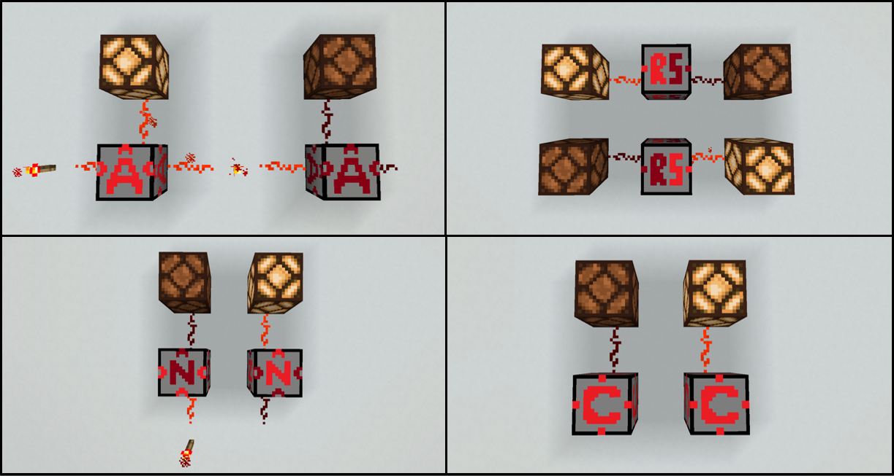
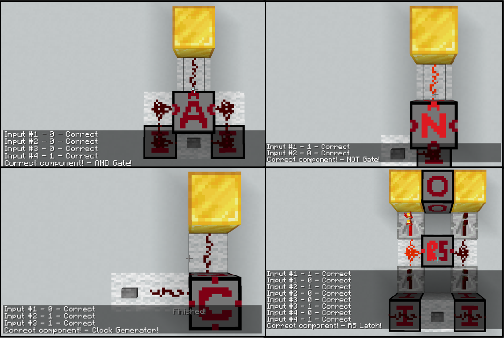
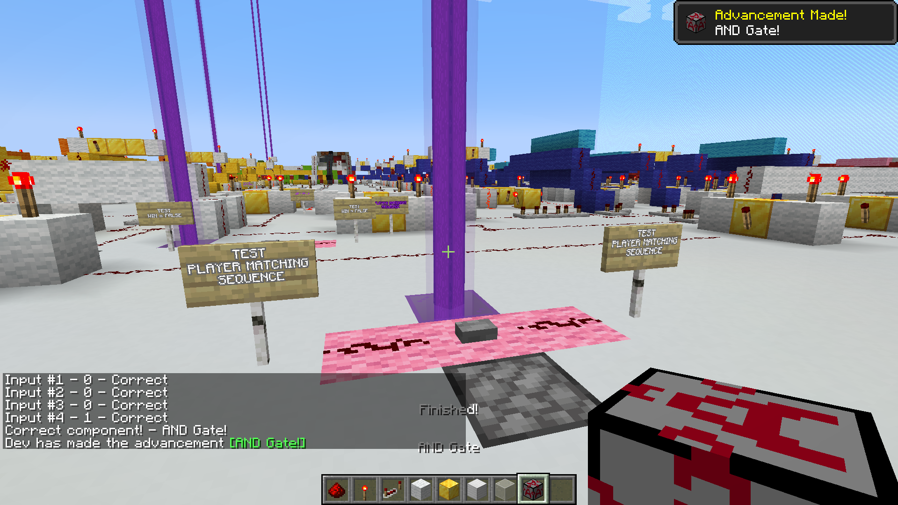

# Artefact - Minecraft Mod for Self-perception of CT Skills
My computing artefact is a modification developed for **Minecraft 1.20.1**. In its packaged (.jar) form, the mod must be ran on the **Forge** mod loader (version 1.20.1-47.0.19). Otherwise, the mod can be ran directly from the directory, though it requires some specific IDE setup. In both cases, **Java** is required to be installed on the computer to run the mod, or otherwise have the IDE/Forge installation contain a reference to a JDK (Java Development Kit) archive. The recommended version of Java is **21.0.6**, though others may work.

*NOTE:* Recommended to read the 'Activity Slides (Variant)' PDF, found in the 'Activity Slides' folder, for an understanding of how the world and mod integrate with one another.\
\
**DOUBLE NOTE:** If you are not playing yourself, please navigate to the **Videos** folder to review a comprehensive showcase of the overall artefact

## Method 1 - Minecraft Forge
This requires:
- The Java version of Minecraft to be installed on the PC (https://www.minecraft.net/en-us/about-minecraft)
- Java to be installed on the PC (https://www.oracle.com/uk/java/technologies/downloads/#jdk21-windows)
- Forge 1.20.1-47.0.19 to be installed onto the Minecraft client (https://files.minecraftforge.net/net/minecraftforge/forge/index_1.20.1.html)
- The mod to be downloaded and placed in the 'mods' folder of your '.minecraft' folder

The steps to play include:
1. Download the Forge version as an installer and run it, installing to your Minecraft client
2. Open the Minecraft launcher and set the play mode to the Forge installation. Play once, then close the game
3. (Optional) If using a JDK archive instead, edit the Forge installation and set the 'Java Executable' to the 'bin\java.exe' of the JDK archive
4. Place the .jar file of the mod into the 'mods' folder, found in AppData\Roaming\\.minecraft
5. (Optional) Place the Variant Test world files into your 'saves' folder, found in AppData\Roaming\\.minecraft
6. Play the game and open a world

## Method 2 - Play from the Code with IntellJ IDEA
This requires:
- A Java compliant IDE, with high recommendation for **IntellJ IDEA**. VSCode can work if *absolutely* necessary
- Java to be installed on the PC (https://www.oracle.com/uk/java/technologies/downloads/#jdk21-windows)

The steps to play include:
1. If installing IntellJ IDEA, enable associations for .java and .gradle
2. Open the 'Mod Directory' folder with the IDE. Wait for Gradle to import. Wait a while.
3. Navigate to the 'Project Structure' settings and select your Java version for the SDK. If using a JDK archive, add it from the disk.
4. Once Gradle has imported, open the taskbar and navigate to the 'forgegradle runs' tasks. Run the 'genIntelljRuns' task.
5. Once the task finishes, run the 'runClient' task.
6. (Optional) When the game opens, navigate to the 'run' folder of the Mod Directory and place the Variant Test world files into the 'saves' folder
7. Open a world

## Code Location
The main code for the mod can be found in: \
**'Mod Directory\src\main\java\com\gmail\robertlancaster03\ctskills'**\
The unit testing code for the mod can be found in:\
**'Mod Directory\src\test\java\com\gmail\robertlancaster03\ctskills\block\entity'**

## Mod Function
The mod implements several 'Tool Blocks' that have the function of computational thinking (CT) concepts, including an AND Gate, NOT Gate, RS Latch and Clock Generator.

The mod also implements an 'Input Block' and 'Output Block' used for in-game unit testing to ascertain the function of these blocks. This function can be performed with either the Tool Blocks or unmodified blocks of the game.

If the implementation of a particular CT concept is confirmed for the first time in the level, the player is awarded the corresponding Tool Block for use.

